  

 

 

## ✦ Stack

plus n8n, Spring AI and Qwen — no icons for those

 

## ✦ Stats

 

  <picture>
    <source media="(prefers-color-scheme: dark)" srcset="https://raw.githubusercontent.com/Queena1021/Queena1021/output/github-snake-dark.svg"/>
    
  </picture>

 

  ˚｡⋆ built with too much tea and one very patient dog ⋆｡˚

